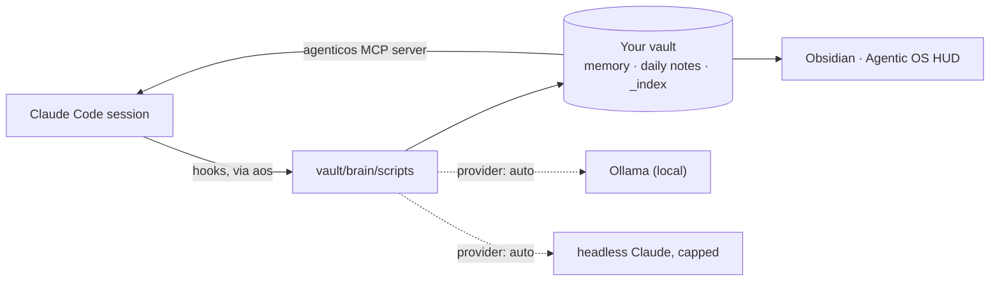

<p align="center">
  
</p>

<h1 align="center">AgenticOS Workbench</h1>

<p align="center">
  <strong>A second brain for Claude Code, and an Obsidian HUD that renders it.</strong><br />
  Persistent memory · recall · session capture · a named Chief of Staff · a live monitor of it all.
</p>

<p align="center">
  <a href="https://github.com/zzoretich/AgenticOS-Workbench/actions/workflows/ci.yml"></a>
  
  
  
  <a href="LICENSE"></a>
</p>

<p align="center">
  <a href="#-quick-start">Quick start</a> ·
  <a href="#-prerequisites">Prerequisites</a> ·
  <a href="#-installation">Installation</a> ·
  <a href="#-your-first-session">First session</a> ·
  <a href="#-everyday-commands">Commands</a> ·
  <a href="#-how-it-works">How it works</a> ·
  <a href="#-docs">Docs</a>
</p>

---

Claude Code forgets everything between sessions. AgenticOS Workbench gives it a vault it can read from on every prompt and write back to at the end of every session, then puts an Obsidian dashboard on top so you can see what it remembers, what ran, and what it cost.

It works with **Claude Code alone**. If a local **Ollama** is running, background work switches to it automatically. Nothing about you ships in this repository, and background work only ever goes through your local Ollama or your own Claude Code login, never a third-party service.

## ✨ What you get

| | |
|---|---|
| 🧠 **Memory that persists** | Facts, feedback rules, projects and references live in your vault as plain Markdown. Every new session opens with a compiled `<brain-context>` block; `/wrap` writes what the session learned. |
| 🔎 **Recall** | Hybrid search over memories, patterns and daily notes, exposed to Claude Code as the `agenticos` MCP server (`recall`, `memory_search`, `session_recall`, `feedback_rules`, …). |
| 🗓️ **Session capture** | Daily notes, working-memory summaries, telemetry with redaction on by default, and a pipeline ledger that shows what ran and when. |
| 🎩 **A Chief of Staff** | A named agent you interview once. Its identity rides along on every prompt; three scheduled duties (monitor, reflect, sitrep) keep the vault tidy and file proposals for anything that needs your sign-off. Kill switch included. |
| 🖥️ **The Agentic OS HUD** | An Obsidian plugin: a Pulse row of pipeline LEDs, live agent runs, a memory graph, a fix queue, an optional chat tab and an optional embedded terminal. |
| 💸 **Cost, opt-in** | A python analyzer that costs every session from its transcript, with a monthly budget in the HUD. Off unless you turn it on. |

## ⚡ Quick start

```sh
git clone https://github.com/zzoretich/AgenticOS-Workbench.git
cd AgenticOS-Workbench
npm ci --ignore-scripts
npm run setup                          # interactive installer (= node cli/aos.js init)
```

Then add the one line the installer prints to `~/.claude/CLAUDE.md`, open the new vault in Obsidian, and start a `claude` session. The whole path takes under ten minutes; the details are in [Installation](#-installation).

## ✅ Prerequisites

| | Required? | What the installer checks |
|---|---|---|
| **macOS or Linux** | required | Windows is not supported in v1: the launcher is POSIX `sh`, scheduling uses launchd on macOS and cron on Linux. |
| **Node.js 20 or newer** | required | `node -v` prints `v20` or later. CI runs on 20 and 22. |
| **git** | required | On macOS it arrives with the Command Line Tools; accept the install dialog if one appears. |
| **Claude Code, logged in** | required | `claude --version` works and `claude auth status` reports a login. Background work runs through the same CLI, so there is nothing else to configure. |
| **Obsidian** | optional | Renders the HUD. Skip it with `--no-obsidian`; everything else still works. |
| **Ollama** | optional | Auto-detected on `127.0.0.1:11434`. When present, background summaries and embeddings run locally and cost nothing. |
| **python3 3.9 or newer** | optional | Only for the cost module (`--cost` at install, or `aos cost enable` later). Standard library only. |

The installer refuses to use `~/.claude` as the vault, and refuses any directory that already holds a `settings.json`. The default vault is `~/AgenticOS`.

## 📦 Installation

### 1. Clone and install dependencies

```sh
git clone https://github.com/zzoretich/AgenticOS-Workbench.git
cd AgenticOS-Workbench
npm ci --ignore-scripts
```

`--ignore-scripts` is enough for the installer, the HUD build and the test suites. The embedded terminal's native module is built only when you ask for it (`--terminal`, or `aos terminal install` later).

### 2. Run the installer

```sh
npm run setup
```

`aos init` asks for a vault directory (default `~/AgenticOS`), then walks through nine steps and prints a checklist at the end:

1. **Preflight** — Node ≥ 20, `claude` on PATH and logged in, Obsidian detected (optional), python3 ≥ 3.9 (only with `--cost`), Ollama reachable (informational).
2. **Seed the vault** — the template files, a `brain/config.json` with the shipped defaults, and Obsidian's daily-notes settings. Existing files are kept.
3. **Vendor the runtime** — the scripts, the `aos` subcommands, the persona templates and the schedule and cost sources into `<vault>/brain/scripts`, plus a symlink at `~/.local/bin/aos`.
4. **Write `~/.claude/agenticos.json`** — the vault path, the node and `claude` binaries it resolved, the provider (`auto`), spend caps, telemetry and feature flags. Honours `CLAUDE_CONFIG_DIR`.
5. **Install the Claude Code plugin** — hooks, the MCP server, slash commands and skills, from this repository's marketplace.
6. **Copy the Obsidian bundle** — into `<vault>/.obsidian/plugins/agentic-os/`, building it from the checkout when needed.
7. **The Chief of Staff interview** — name your agent (say, *Atlas*), how it addresses you, its voice, what it should watch, the model and effort for background duties, and whether to schedule the daily duties.
8. **First scan** — compiles `BRAIN.md`, builds the recall index.
9. **Checklist** — every file written, the line to add to your `CLAUDE.md`, and how to open the vault.

Useful flags: `--vault <dir>` · `--provider auto|ollama|claude|none` · `--no-obsidian` · `--terminal` · `--cost [--budget <usd>]` · `--persona-json <file>` (answer the interview from a file; use it wherever stdin is not a terminal) · `--yes` (accept defaults, no prompts) · `--dry-run` (print the numbered plan, write nothing). Working from a checkout? `npm run setup -- --from-local .` installs the plugin from your clone instead of GitHub. A misspelled flag is a usage error, so a typo never starts a real install.

### 3. Put `aos` on your PATH and check the install

```sh
export PATH="$HOME/.local/bin:$PATH"   # add the same line to ~/.zprofile or ~/.bashrc
aos doctor                             # exits 0 when every check passes
```

### 4. Wire Claude Code to the vault

The installer never edits your `CLAUDE.md`. Add the line it printed — it looks like this, with your vault's absolute path:

```
@/path/to/AgenticOS/AGENTICOS.md
```

### 5. Open the HUD

In Obsidian: **File → Open vault → Open folder as vault**, pick your vault, enable community plugins when asked, and turn on **Agentic OS**. The HUD opens with a Pulse row that stays gray or green; amber `stale` LEDs simply mean a stage has not run for a while.

## 🚀 Your first session

Run `claude` in any directory and ask it *what do you know about me?* The first prompt arrives with `<brain-context>` (and your agent's `<persona>`). When you are done, `/wrap` extracts memories into `<vault>/brain/memory/` and adds a line to `MEMORY.md`. In a later session, *use the agenticos recall tool to search for …* answers from your own notes.

Say `sitrep` for a one-action briefing on where your work stands, and `review persona flags` to walk through anything your agent has flagged or proposed.

## 🧰 Everyday commands

**On the command line**

| Command | Does |
|---|---|
| `aos doctor` | Checks Node, the Claude login, `agenticos.json`, the vault layout, the plugin, the MCP handshake, the Obsidian bundle, Ollama and python3. Exit 1 on any failure. |
| `aos status` | The resolved provider and why, today's spend against the caps, and the pipeline ledger. |
| `aos provider auto\|ollama\|claude\|none` | Force a provider or go back to `auto`. |
| `aos upgrade` | Updates the plugin, re-vendors the runtime and bundle, adds new config keys (your values win). Never touches memory, notes or persona. |
| `aos persona` · `aos persona on\|off\|rename <name>` | Re-run the interview, flip the kill switch, or rename your agent. |
| `aos cost enable [--budget <usd>]` · `aos cost disable` | Opt in or out of session costing. |
| `aos terminal install` | Builds the native module for the HUD's terminal tab. |
| `aos uninstall [--keep-vault]` | Removes the plugin, the schedules, the symlink and `agenticos.json`. The vault is deleted only if you type its path back. |

Every runtime script is also reachable as `aos <name>` — `aos scan-vault`, `aos recall "<query>"`, `aos build-brain-md`, and so on.

**Inside Claude Code**

| Command | Does |
|---|---|
| `/remember <text>` | Append a note to this session's working memory; tag it `#promote` to make it permanent at `/wrap`. |
| `/wrap` | Session-end protocol: promote `#promote` items, extract this session's memories, summarise into today's daily note. |
| `/feedback` · `/pattern` · `/project` | Capture a feedback rule, a decision pattern, or project context as a permanent memory. |
| `/brain` · `/scan` | Show the current brain state; refresh the dashboard caches (full scan, `BRAIN.md`, recall index). |
| `/ask-brain <question>` | Assemble the relevant memories and answer from them. |
| `/standup` · `/reflect-week` · `/consolidate-memory` · `/compress` | A Did/Doing/Blockers standup, a weekly reflection, a memory-merge draft, a distillate of a large file. The context is assembled locally; Claude answers in your own session. |
| `/cost` · `/aos` | Cost completed sessions from their transcripts (cost module only); maintenance from inside a session — doctor, status, provider, persona. |

Skills answer to plain phrases: *sitrep* (or `/agenticos:persona-sitrep`), *review persona flags* (`/agenticos:persona-flag-closer`), plus `recall`, `wrap`, `feedback-review` and `cost`.

## 🔍 How it works



- **Hooks.** The Claude Code plugin registers hooks for session start, every prompt, every tool use, stop and session end. Each one runs `aos <script>` inside your vault: inject context, update working memory, stream telemetry, write the heartbeat, cost the session, wrap it, rescan.
- **The vault** is an ordinary folder that is both an Obsidian vault and Claude Code's second brain. `AGENTICOS.md` documents the layout and the three-file rule: `MEMORY.md` is the index, `brain/memory/<type>/` holds the content, `brain/_index/BRAIN.md` is the compiled bootstrap injected on the first turn.
- **Providers.** `auto` picks Ollama when it answers, otherwise headless Claude (`claude -p --model haiku`, capped per call and per day, every call ledgered), otherwise `none`. Under `none` nothing calls a model in the background; summaries are heuristic and `/wrap` extracts memories inside your own session through the `wrap_session` tool. Install Ollama later and `auto` switches over on its own.
- **The HUD** reads the same files: the pipeline ledger, live agent runs, the memory graph, provider state, spend, and your agent's identity and flags.

## 🔒 Privacy

- Your vault stays on your machine. Background calls go to your local Ollama or to your own Claude login; the cost analyzer runs with `--no-api`.
- Telemetry redaction is on by default.
- This repository ships machinery, not content: the Chief of Staff's identity, state and playbook are generated for you at install. A privacy gate (`npm run gate`) runs in CI against a fixed term list so nothing personal can land here.

## 🗂️ Repository layout

```
brain/scripts      the runtime that gets vendored into your vault (hooks, collectors, recall, MCP server, persona)
cli                the installer and the aos subcommands (persona, schedule, cost) + an install rehearsal
plugin             the Claude Code plugin: hooks.json, .mcp.json, bin/aos, 14 commands, 6 skills
obsidian-plugin    the Agentic OS HUD (TypeScript, esbuild)
vault-template     the seed vault (AGENTICOS.md, MEMORY.md, brain/, persona templates)
extras             schedule templates (launchd, cron), the cost analyzer, optional Ollama helpers
tools              export-from-vault and the privacy gate
docs               install, chief of staff, cost, the Obsidian smoke checklist, the release acceptance runbook
```

## 🛠️ Development

```sh
npm test                 # every suite: tools + cli, brain/scripts, obsidian-plugin
npm run gate             # the privacy gate — fails on any forbidden term
cd extras/cost && python3 -m unittest      # the cost analyzer's tests
sh cli/rehearsal/first-run.sh              # a complete install in a temp HOME with a fake claude (what CI runs)
npm run build -w obsidian-plugin           # rebuild the HUD bundle
```

`brain/scripts/test/live/` needs a running Ollama and is excluded from `npm test`. The Obsidian plugin's manual checklist is `docs/plugin-smoke.md`; the per-release acceptance runbook is `docs/acceptance.md`.

## 🧹 Uninstall

```sh
aos uninstall --keep-vault     # remove the plugin, schedules, symlink and agenticos.json; keep the vault
aos uninstall                  # additionally delete the vault, after you type its path back
```

`~/.claude` is left exactly as it was. The vault is never deleted when it is your home directory or a Claude config directory.

## 📚 Docs

| | |
|---|---|
| [docs/install.md](docs/install.md) | Every installer step and flag, providers and spend caps, the orphan sweep, daily-note layout. |
| [docs/chief-of-staff.md](docs/chief-of-staff.md) | The interview, the persona layout, duties and schedules, proposals, the kill switch, caps. |
| [docs/cost.md](docs/cost.md) | The cost module: enabling it, what it records, the budget, CI. |
| [docs/plugin-smoke.md](docs/plugin-smoke.md) | The HUD's manual smoke checklist. |
| [docs/acceptance.md](docs/acceptance.md) | The release acceptance runbook, run on a fresh macOS account. |
| [extras/ollama/README.md](extras/ollama/README.md) | Running Ollama as a supervised service, pulling the default models. |

## 📄 License

[MIT](LICENSE) — AgenticOS Workbench contributors.
