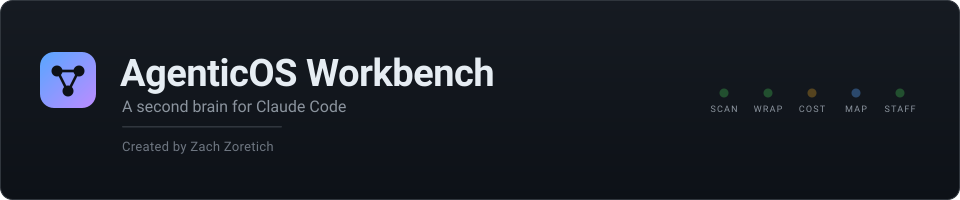
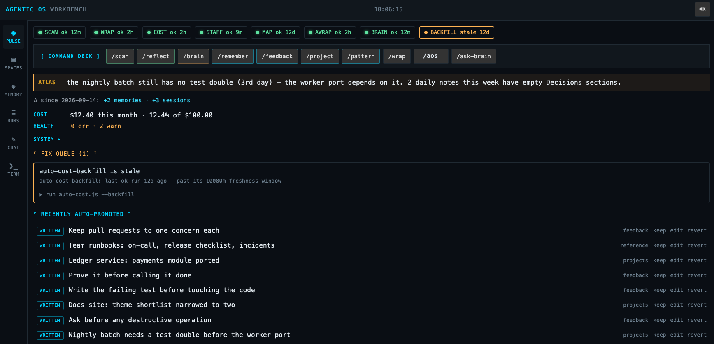
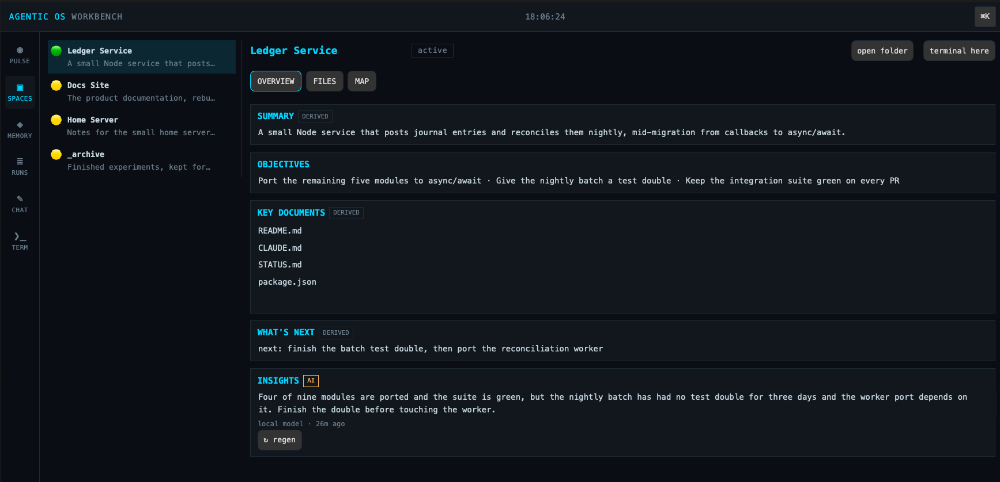
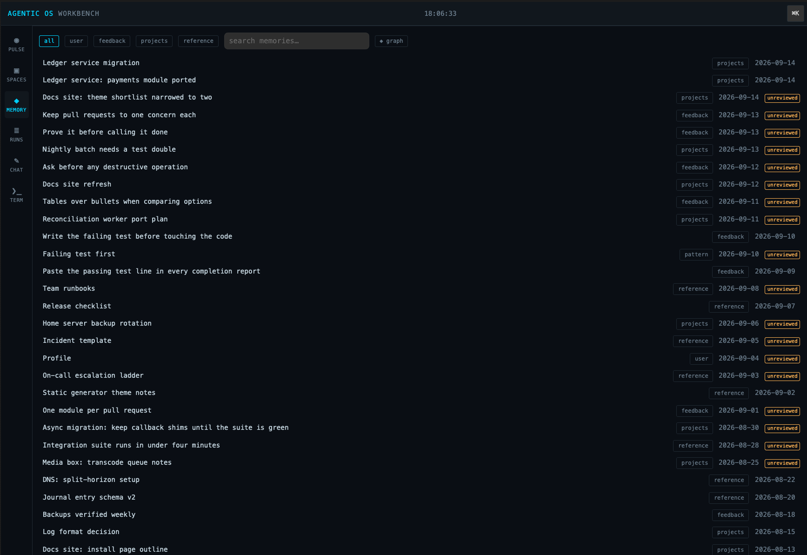
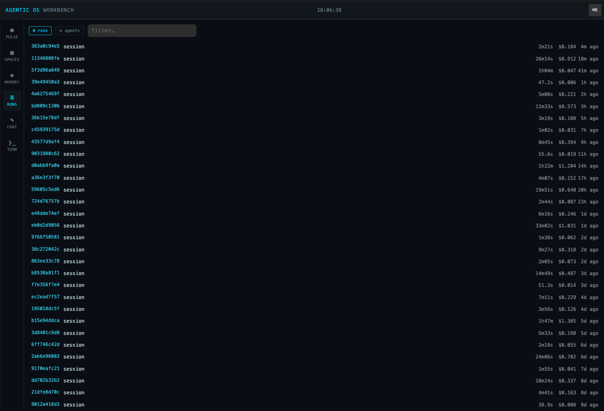
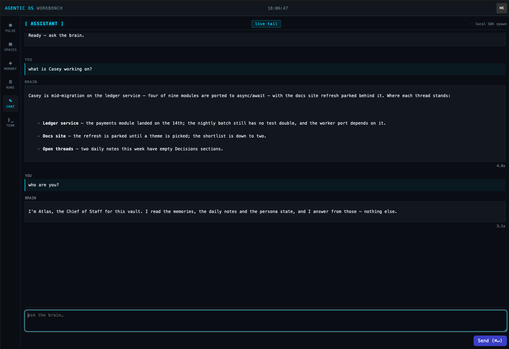
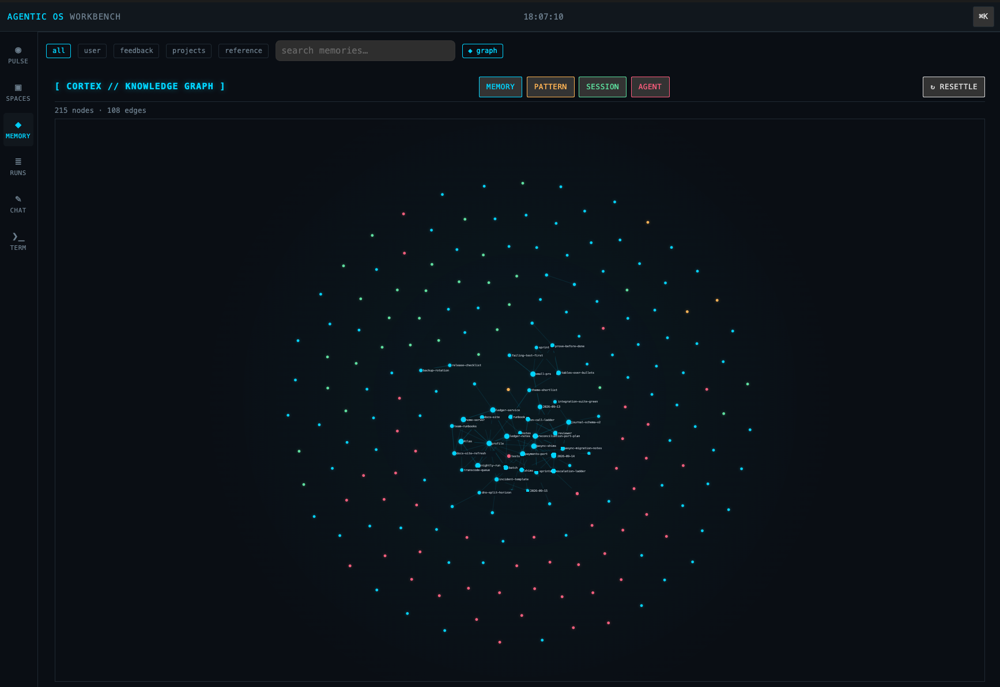
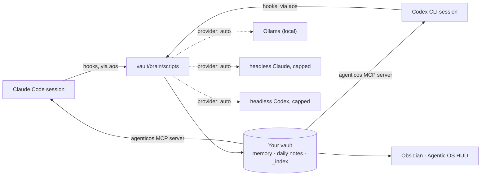
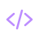

<p align="center">
  
</p>

<p align="center">
  <strong>A second brain for Claude Code and Codex CLI, and an Obsidian HUD that renders it.</strong><br />
  Persistent memory · recall · session capture · a named Chief of Staff · a live monitor of it all.
</p>

<p align="center">
  <a href="https://github.com/zzoretich/AgenticOS-Workbench/actions/workflows/ci.yml"></a>
  
  
  
  <a href="LICENSE"></a>
</p>

<p align="center">
  <a href="#quick-start">Quick start</a> ·
  <a href="#prerequisites">Prerequisites</a> ·
  <a href="#installation">Installation</a> ·
  <a href="#screenshots">Screenshots</a> ·
  <a href="#your-first-session">First session</a> ·
  <a href="#everyday-commands">Commands</a> ·
  <a href="#how-it-works">How it works</a> ·
  <a href="#docs">Docs</a>
</p>

<p align="center"></p>

Claude Code and Codex CLI forget everything between sessions. AgenticOS Workbench gives them a vault they can read from on every prompt and write back to at the end of every session, then puts an Obsidian dashboard on top so you can see what they remember, what ran, and what it cost.

It works with **Claude Code alone**, with **Codex CLI alone**, or with both sharing one vault. If a local **Ollama** is running, background work switches to it automatically. Nothing about you ships in this repository, and background work only ever goes through your local Ollama or your own Claude Code or Codex login, never a third-party service.

<a name="what-you-get"></a>
##  What you get

| | |
|---|---|
|  | **Memory that persists.** Facts, feedback rules, projects and references live in your vault as plain Markdown. Every new session opens with a compiled `<brain-context>` block; `/wrap` writes what the session learned. |
|  | **Recall.** Hybrid search over memories, patterns and daily notes, exposed to Claude Code as the `agenticos` MCP server (`recall`, `memory_search`, `session_recall`, `feedback_rules`, …). |
|  | **Session capture.** Daily notes, working-memory summaries, telemetry with redaction on by default, and a pipeline ledger that shows what ran and when. |
|  | **A Chief of Staff.** A named agent you interview once. Its identity rides along on every prompt; three scheduled duties (monitor, reflect, sitrep) keep the vault tidy and file proposals for anything that needs your sign-off. Kill switch included. |
|  | **Routines.** Recurring actions as files — `brain/routines/<slug>.md` with a cron schedule and a kind (a persona duty, a headless prompt for Claude Code or Codex, or a command). One `aos routines sync` renders the launchd or cron schedules; the HUD tab shows next fire, last run and health, and edits the same files. The same tab lists, read-only, the routines your session hosts own: Codex app Automations and Claude Code cloud routines. |
|  | **The Agentic OS HUD.** An Obsidian plugin: a Pulse row of pipeline LEDs, live agent runs, a memory graph, a fix queue, a routines tab, an optional chat tab and an optional embedded terminal. |
|  | **Cost, opt-in.** A python analyzer that costs every session from its transcript, with a monthly budget in the HUD. Off unless you turn it on. |

<a name="quick-start"></a>
##  Quick start

```sh
git clone https://github.com/zzoretich/AgenticOS-Workbench.git
cd AgenticOS-Workbench
npm ci --ignore-scripts
npm run setup                          # interactive installer (= node cli/aos.js init)
```

Then add the one line the installer prints to `~/.claude/CLAUDE.md` (Claude Code) or trust the hook entries once under `/hooks` (Codex), open the new vault in Obsidian, and start a `claude` or `codex` session. The whole path takes under ten minutes; the details are in [Installation](#installation).

<a name="prerequisites"></a>
##  Prerequisites

| | Required? | What the installer checks |
|---|---|---|
| **macOS or Linux** | required | Windows is not supported in v1: the launcher is POSIX `sh`, scheduling uses launchd on macOS and cron on Linux. |
| **Node.js 20 or newer** | required | `node -v` prints `v20` or later. CI runs on 20 and 22. |
| **git** | required | On macOS it arrives with the Command Line Tools; accept the install dialog if one appears. |
| **Claude Code and/or Codex CLI, logged in** | one required | `claude auth status` reports a login, or `codex login status` does (or both). `aos init` wires every host it finds; `--host claude\|codex\|both` picks. Background work runs through the same CLI, so there is nothing else to configure. |
| **Obsidian** | optional | Renders the HUD. Skip it with `--no-obsidian`; everything else still works. |
| **Ollama** | optional | Auto-detected on `127.0.0.1:11434`. When present, background summaries and embeddings run locally and cost nothing. |
| **python3 3.9 or newer** | optional | Only for the cost module (`--cost` at install, or `aos cost enable` later). Standard library only. |

The installer refuses to use `~/.claude` as the vault, and refuses any directory that already holds a `settings.json`. The default vault is `~/AgenticOS`.

<p align="center"></p>

<a name="installation"></a>
##  Installation

### 1. Clone and install dependencies

```sh
git clone https://github.com/zzoretich/AgenticOS-Workbench.git
cd AgenticOS-Workbench
npm ci --ignore-scripts
```

`--ignore-scripts` is enough for the installer, the HUD build and the test suites. The embedded terminal's native module is built only when you ask for it (`--terminal`, or `aos terminal install` later).

### 2. Run the installer

```sh
npm run setup
```

`aos init` asks for a vault directory (default `~/AgenticOS`), then walks through nine steps and prints a checklist at the end:

1. **Preflight** — Node ≥ 20, at least one host CLI (`claude`, `codex`) on PATH and logged in, Obsidian detected (optional), python3 ≥ 3.9 (only with `--cost`), Ollama reachable (informational).
2. **Seed the vault** — the template files, a `brain/config.json` with the shipped defaults, and Obsidian's daily-notes settings. Existing files are kept.
3. **Vendor the runtime** — the scripts, the `aos` subcommands, the persona templates and the schedule and cost sources into `<vault>/brain/scripts`, plus a symlink at `~/.local/bin/aos`.
4. **Write `~/.claude/agenticos.json`** — the vault path, the node, `claude` and `codex` binaries it resolved, the enabled hosts, the provider (`auto`), spend caps, telemetry and feature flags. Honours `CLAUDE_CONFIG_DIR`.
5. **Wire the hosts** — Claude Code: the plugin (hooks, the MCP server, slash commands and skills) from this repository's marketplace. Codex CLI: five hook entries in `~/.codex/hooks.json`, `codex mcp add agenticos`, and the 15 commands plus 6 skills generated as Codex skills under `~/.agents/skills/` (`$wrap`, `$remember`, …).
6. **Copy the Obsidian bundle** — into `<vault>/.obsidian/plugins/agentic-os/`, building it from the checkout when needed.
7. **The Chief of Staff interview** — name your agent (say, *Atlas*), how it addresses you, its voice, what it should watch, the model and effort for background duties, and whether to schedule the daily duties.
8. **First scan** — compiles `BRAIN.md`, builds the recall index.
9. **Checklist** — every file written, the line to add to your `CLAUDE.md` or the `/hooks` entries to trust in Codex, and how to open the vault.

Useful flags: `--vault <dir>` · `--host auto|claude|codex|both` · `--provider auto|ollama|claude|codex|none` · `--no-obsidian` · `--terminal` · `--cost [--budget <usd>]` · `--persona-json <file>` (answer the interview from a file; use it wherever stdin is not a terminal) · `--yes` (accept defaults, no prompts) · `--dry-run` (print the numbered plan, write nothing). Working from a checkout? `npm run setup -- --from-local .` installs the plugin from your clone instead of GitHub. A misspelled flag is a usage error, so a typo never starts a real install.

### 3. Put `aos` on your PATH and check the install

```sh
export PATH="$HOME/.local/bin:$PATH"   # add the same line to ~/.zprofile or ~/.bashrc
aos doctor                             # exits 0 when every check passes
```

### 4. Wire Claude Code to the vault

The installer never edits your `CLAUDE.md`. Add the line it printed — it looks like this, with your vault's absolute path:

```
@/path/to/AgenticOS/AGENTICOS.md
```

### 4b. Wire Codex CLI to the vault

Nothing to paste: Codex's `AGENTS.md` has no include syntax, so a SessionStart hook injects `AGENTICOS.md` at every session start (and again after compaction). Codex quarantines new hooks until you have seen them once: open `codex`, run `/hooks`, and trust the AgenticOS entries. They stay trusted across `aos upgrade` because every entry runs the vault's own launcher at a fixed path. Slash commands are skills there: `$wrap`, `$remember`, `$brain`, and so on, with the same words as under Claude Code. Add Codex to an existing install with `aos init --host both`; remove just that wiring with `aos uninstall --host codex`. An install made before 0.7.0 registered the MCP server without its host marker; `aos doctor` reports it as stale and `aos upgrade` re-registers it.

### 5. Open the HUD

In Obsidian: **File → Open vault → Open folder as vault**, pick your vault, enable community plugins when asked, and turn on **Agentic OS**. The HUD opens with a Pulse row that stays gray or green; amber `stale` LEDs simply mean a stage has not run for a while.

<p align="center"></p>

<a name="screenshots"></a>
##  Screenshots

The HUD on a demo vault: a user called Casey, an agent called Atlas, two workspaces, a handful of memories, and a local Ollama as the provider.

<p align="center">
  
  <br /><sub><b>Pulse.</b> Eight pipeline LEDs, the command deck, Atlas's latest flag, month-to-date cost, the fix queue, and what got promoted to memory this week.</sub>
</p>

<table>
  <tr>
    <td width="50%" valign="top">
      
      <br /><sub><b>Spaces.</b> Every workspace in the vault with its status, objectives, key documents and a generated insight.</sub>
    </td>
    <td width="50%" valign="top">
      
      <br /><sub><b>Memory.</b> Every memory by type and date, searchable, with review badges for what the wrap wrote on its own.</sub>
    </td>
  </tr>
  <tr>
    <td width="50%" valign="top">
      
      <br /><sub><b>Runs.</b> Every Claude Code session, with duration, cost and age; click one for its tool timeline.</sub>
    </td>
    <td width="50%" valign="top">
      
      <br /><sub><b>Chat.</b> Ask the brain a question; it answers from your own notes through whichever provider is live.</sub>
    </td>
  </tr>
</table>

<p align="center">
  
  <br /><sub><b>Cortex.</b> Memories, patterns, sessions and agents as a force graph.</sub>
</p>

<p align="center"></p>

<a name="your-first-session"></a>
##  Your first session

Run `claude` in any directory and ask it *what do you know about me?* The first prompt arrives with `<brain-context>` (and your agent's `<persona>`). When you are done, `/wrap` extracts memories into `<vault>/brain/memory/` and adds a line to `MEMORY.md`. In a later session, *use the agenticos recall tool to search for …* answers from your own notes.

Say `sitrep` for a one-action briefing on where your work stands, and `review persona flags` to walk through anything your agent has flagged or proposed. A heartbeat watches the agent itself: a duty that misses its schedule becomes a flag in your next session, an OS notification and a red pill in the HUD; an hourly tick (skipped when nothing changed, about a dollar a day at most) queues new corrections, failures and stalls; a short nightly reflect drains that queue into at most two proposals (brought forward the same day when the queue fills up); ideas you accept land in a backlog; every proposal outcome is kept in a ledger the agent reads before proposing again; and a class of change you have approved and kept three times can be proposed for auto-apply, which only your approval switches on.

<a name="everyday-commands"></a>
##  Everyday commands

**On the command line**

| Command | Does |
|---|---|
| `aos doctor` | Checks Node, `agenticos.json`, the vault layout, the MCP handshake, the Obsidian bundle, Ollama and python3, plus one block per enabled host: the Claude login and plugin, or the Codex login, hook entries, MCP registration and generated skills; and which CLI runs persona duties and prompt routines. Exit 1 on any failure. |
| `aos status` | The resolved provider and why, today's spend against the caps, and the pipeline ledger. |
| `aos provider auto\|ollama\|claude\|codex\|none` | Force a provider or go back to `auto`. |
| `aos upgrade` | Updates the plugin, re-vendors the runtime and bundle, re-wires the Codex host when it is enabled, adds new config keys (your values win). Never touches memory, notes or persona. |
| `aos persona` · `aos persona on\|off\|rename <name>` | Re-run the interview, flip the kill switch, or rename your agent. |
| `aos cost enable [--budget <usd>]` · `aos cost disable` | Opt in or out of session costing. |
| `aos routines list\|sync\|run <slug>\|enable <slug>\|disable <slug>\|next` · `aos routines hosts [--refresh]` · `aos routines import-cloud <file>` | The recurring actions in `brain/routines/`: list with cadence, next fire and health; render and load the OS schedules; run one now; flip one on or off. `hosts` lists, read-only, the routines each session host owns — the Codex app's Automations (read live from its local database) and the Claude Code cloud routines (a snapshot a session imports with `/routines cloud`). |
| `aos workspace list\|new <name>\|adopt <path>` | The projects in `workspaces/`: list them with each host's session counts and the folders sessions ran in elsewhere; create one with `README.md`, `CLAUDE.md` and `AGENTS.md`; move an existing project folder in. |
| `aos terminal install` | Builds the native module for the HUD's terminal tab. |
| `aos uninstall [--keep-vault]` · `aos uninstall --host codex` | Removes the plugin, the Codex hook entries, MCP registration and generated skills, the schedules, the symlink and `agenticos.json`. The vault is deleted only if you type its path back. `--host claude\|codex` unwires one host and keeps everything else. |

Every runtime script is also reachable as `aos <name>` — `aos scan-vault`, `aos recall "<query>"`, `aos build-brain-md`, and so on.

**Inside a session** (Claude Code: `/name` · Codex CLI: `$name`)

| Command | Does |
|---|---|
| `/remember <text>` | Append a note to this session's working memory; tag it `#promote` to make it permanent at `/wrap`. |
| `/wrap` | Session-end protocol: promote `#promote` items, extract this session's memories, summarise into today's daily note. |
| `/feedback` · `/pattern` · `/project` | Capture a feedback rule, a decision pattern, or project context as a permanent memory. |
| `/brain` · `/scan` | Show the current brain state; refresh the dashboard caches (full scan, `BRAIN.md`, recall index). |
| `/ask-brain <question>` | Assemble the relevant memories and answer from them. |
| `/standup` · `/reflect-week` · `/consolidate-memory` · `/compress` | A Did/Doing/Blockers standup, a weekly reflection, a memory-merge draft, a distillate of a large file. The context is assembled locally; Claude answers in your own session. |
| `/cost` · `/aos` | Cost completed sessions from their transcripts (cost module only); maintenance from inside a session — doctor, status, provider, persona. |
| `/routines [list\|sync\|run <slug>\|enable\|disable\|next\|hosts\|cloud]` | The same verbs as `aos routines`, from inside a session; `cloud` fetches your Claude Code cloud routines (the in-session `RemoteTrigger` tool) and imports the snapshot. |

Skills answer to plain phrases: *sitrep* (or `/agenticos:persona-sitrep`), *review persona flags* (`/agenticos:persona-flag-closer`), plus `recall`, `wrap`, `feedback-review` and `cost`. Under Codex every one of these is a skill named the same way (`$persona-sitrep`, `$recall`, …) and the MCP tools are `mcp__agenticos__<tool>`.

### Staying up to date

`aos upgrade` pulls the newest version. To be told when there is one, AgenticOS writes a one-line
fragment that is either empty or the update notice, at `<vault>/brain/_index/update-line.txt`. With
the default vault (`~/AgenticOS`, unless you passed `--vault` to `aos init`):

```sh
cat "$HOME/AgenticOS/brain/_index/update-line.txt" 2>/dev/null
```

If you used a different vault, `aos update-status --statusline` prints the same fragment without you
having to hardcode the path:

```sh
aos update-status --statusline 2>/dev/null
```

Add either line to your own status line script and it contributes nothing until an update exists.
Both read a file (the second through one short-lived `aos` process) and never touch the network, so
they cost nothing per render. AgenticOS never edits your `settings.json` or claims the status line
itself.

You are also told once at the start of every session. The check itself runs at most once a day, in a
detached process, so nothing ever waits on GitHub.

```sh
aos update-status                 # what is installed, what is available
aos update-status --snooze 7d     # silence this version for a week
aos update-status --off           # stop checking entirely
aos update-check                  # check right now
```

<p align="center"></p>

<a name="how-it-works"></a>
##  How it works

<p align="center"></p>



- **Hosts.** A session runs under Claude Code, Codex CLI, or either of two on one vault. The runtime is the same; only the wiring differs: Claude Code loads the plugin, Codex loads the hook entries, MCP registration and skills that `aos init --host codex` writes into its own config. The three modes are equivalent: **Claude Code only**, **Codex only**, or **both on one vault**. A hook learns which host fired it from one environment variable the wiring sets; where nothing sets it (the MCP server, an `aos` verb run inside a session), the runtime works it out from the session transcript's path, then from the config when only one host is enabled. One transcript reader understands both CLIs' session logs, and telemetry records the host and model of every run.
- **Hooks.** Both hosts fire hooks for session start, every prompt, every tool use, stop and session end. Each one runs `aos <script>` inside your vault: inject context, update working memory, stream telemetry, write the heartbeat, cost the session, wrap it, rescan. Under Codex the conventions file is injected at every session start too, since `AGENTS.md` cannot include it. Codex fires session end late (thread close, or 30 minutes idle) and never under `codex exec`, so a reconcile pass on every session start and stop finishes any run idle for `telemetry.staleAfterMinutes`: it closes the telemetry, costs it and wraps it exactly as session end would have. A Claude Code terminal killed mid-session is healed the same way.
- **Runners.** Persona duties and `prompt` routines run through `claude -p` when Claude Code is wired and installed, otherwise through `codex exec` (workspace-write sandbox, our hooks off, the spend estimated from its token counts since Codex has no budget flag; the daily caps still gate every start). `persona.runner` and `routines.runner` pin one; `aos doctor` shows the choice. The HUD's Chat tab is the one surface that still needs the `claude` CLI.
- **The vault** is an ordinary folder that is both an Obsidian vault and the agent's second brain. Its `workspaces/` folder is the home for project working directories of both hosts: a project is anything with a `README.md`, `CLAUDE.md`, `AGENTS.md`, `STATUS.md`, `PLAN.md` or `.git`, every scan pins each host's sessions to the workspace they ran in, and the Spaces tab lists whatever ran outside. `AGENTICOS.md` documents the layout and the three-file rule: `MEMORY.md` is the index, `brain/memory/<type>/` holds the content, `brain/_index/BRAIN.md` is the compiled bootstrap injected on the first turn.
- **Providers.** `auto` picks Ollama when it answers, otherwise headless Claude (`claude -p --model haiku`, capped per call and per day, every call ledgered), otherwise headless Codex when Codex is a wired host (`codex exec`, read-only, hooks off, spend estimated from its token counts), otherwise `none`. Under `none` nothing calls a model in the background; summaries are heuristic and `/wrap` extracts memories inside your own session through the `wrap_session` tool. Install Ollama later and `auto` switches over on its own. One role is the exception: the **reasoner** behind `/ask-brain --local`, `/reflect-week`, `/consolidate-memory` and the HUD's Chat tab is a Claude model (`reasoner.model`, default `claude-opus-5`, with its own per-call and per-day caps) whatever `auto` resolved, and falls back to the local workhorse when Claude is unavailable.
- **The HUD** reads the same files: the pipeline ledger, live agent runs, the memory graph, provider state, spend, and your agent's identity and flags.

<a name="privacy"></a>
##  Privacy

- Your vault stays on your machine. Background calls go to your local Ollama or to your own Claude or Codex login; the cost analyzer runs with `--no-api`.
- Telemetry redaction is on by default.
- This repository ships machinery, not content: the Chief of Staff's identity, state and playbook are generated for you at install. A privacy gate (`npm run gate`) runs in CI against a fixed term list so nothing personal can land here.

<a name="repository-layout"></a>
##  Repository layout

```
brain/scripts      the runtime that gets vendored into your vault (hooks, collectors, recall, MCP server, persona)
cli                the installer and the aos subcommands (persona, schedule, routines, cost, the Codex host) + two install rehearsals
plugin             the Claude Code plugin: hooks.json, .mcp.json, bin/aos, 15 commands, 6 skills (also the source of the generated Codex skills)
obsidian-plugin    the Agentic OS HUD (TypeScript, esbuild)
vault-template     the seed vault (AGENTICOS.md, MEMORY.md, brain/ incl. the three duty routines, persona templates incl. the heartbeat watchdog, hourly tick and nightly reflect routines)
extras             the launchd schedule template, the cost analyzer, optional Ollama helpers
tools              export-from-vault, the privacy gate, and the brand-asset generator behind docs/assets
docs               install, chief of staff, cost, the Obsidian smoke checklist, the release acceptance runbook
```

<a name="development"></a>
##  Development

```sh
npm test                 # every suite: tools + cli, brain/scripts, obsidian-plugin
npm run gate             # the privacy gate — fails on any forbidden term
cd extras/cost && python3 -m unittest      # the cost analyzer's tests
sh cli/rehearsal/first-run.sh              # a complete install in a temp HOME with a fake claude (what CI runs)
sh cli/rehearsal/codex-host.sh             # the same for a Codex-only machine: fake codex, hooks run for real, doctor, uninstall
npm run build -w obsidian-plugin           # rebuild the HUD bundle
node tools/brand-assets.js                 # regenerate the brand assets under docs/assets
```

`brain/scripts/test/live/` needs a running Ollama and is excluded from `npm test`. The Obsidian plugin's manual checklist is `docs/plugin-smoke.md`; the per-release acceptance runbook is `docs/acceptance.md`.

<a name="uninstall"></a>
##  Uninstall

```sh
aos uninstall --keep-vault     # remove the plugin, the Codex wiring, schedules, symlink and agenticos.json; keep the vault
aos uninstall                  # additionally delete the vault, after you type its path back
aos uninstall --host codex     # unwire only the Codex host (hooks, MCP registration, generated skills); keep everything else
```

`~/.claude` and `~/.codex` are left exactly as they were (a `hooks.json` that held only our entries is removed; one with your own entries keeps them). The vault is never deleted when it is your home directory or a Claude config directory.

<a name="docs"></a>
##  Docs

| | |
|---|---|
| [docs/install.md](docs/install.md) | Every installer step and flag, providers and spend caps, the orphan sweep, daily-note layout. |
| [docs/chief-of-staff.md](docs/chief-of-staff.md) | The interview, the persona layout, duties as routine files and their schedules, the heartbeat watchdog, proposals and their outcome ledger, the kill switch, caps. |
| [docs/cost.md](docs/cost.md) | The cost module: enabling it, what it records, the budget, CI. |
| [docs/plugin-smoke.md](docs/plugin-smoke.md) | The HUD's manual smoke checklist. |
| [docs/acceptance.md](docs/acceptance.md) | The release acceptance runbook, run on a fresh macOS account. |
| [extras/ollama/README.md](extras/ollama/README.md) | Running Ollama as a supervised service, pulling the default models. |

<p align="center"></p>

<a name="credits"></a>
##  Credits

Created by **Zach Zoretich** — [@zzoretich](https://github.com/zzoretich).

Built with [Claude Code](https://claude.com/claude-code). The brand assets under `docs/assets/` are
generated, not hand-drawn: `node tools/brand-assets.js` rebuilds all 23 from one palette in
[tools/brand-assets.js](tools/brand-assets.js), and `tools/brand-assets.test.js` holds them to being
inert, on-palette and byte-stable.

Issues and pull requests are welcome — the project stays contributor-owned under the license below.

<a name="license"></a>
##  License

[MIT](LICENSE) — AgenticOS Workbench contributors.

<p align="center"></p>
