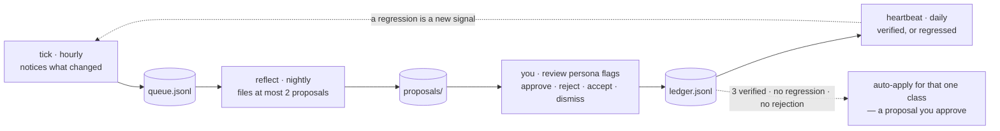
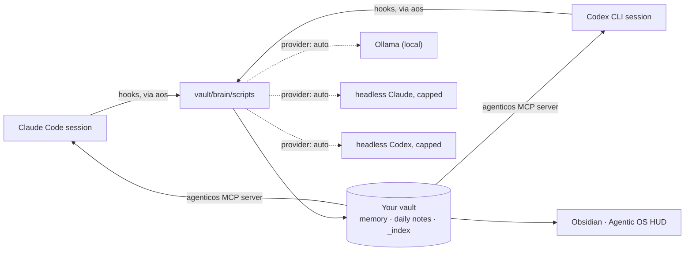

<p align="center">
  
</p>

<p align="center">
  <strong>A second brain for Claude Code and Codex CLI, and an Obsidian HUD that renders it.</strong><br />
  Persistent memory · recall · session capture · a named Chief of Staff · a live monitor of it all.
</p>

<p align="center">
  <a href="https://github.com/zzoretich/AgenticOS-Workbench/actions/workflows/ci.yml"></a>
  
  
  
  <a href="LICENSE"></a>
</p>

<p align="center">
  <a href="#quick-start">Quick start</a> ·
  <a href="#prerequisites">Prerequisites</a> ·
  <a href="#installation">Installation</a> ·
  <a href="#screenshots">Screenshots</a> ·
  <a href="#your-first-session">First session</a> ·
  <a href="#chief-of-staff">Chief of Staff</a> ·
  <a href="#everyday-commands">Commands</a> ·
  <a href="#how-it-works">How it works</a> ·
  <a href="#docs">Docs</a>
</p>

<p align="center"></p>

Claude Code and Codex CLI forget everything between sessions. AgenticOS Workbench gives them a vault they can read from on every prompt and write back to at the end of every session, then puts an Obsidian dashboard on top so you can see what they remember, what ran, and what it cost.

It works with **Claude Code alone**, with **Codex CLI alone**, or with both sharing one vault. While your local **Ollama** is running, background work goes to it automatically. Nothing about you ships in this repository, and background work only ever goes through your local Ollama or your own Claude Code or Codex login, never a third-party service.

<a name="what-you-get"></a>
##  What you get

| | |
|---|---|
|  | **Memory that persists.** Facts, feedback rules, projects and references live in your vault as plain Markdown. Every new session opens with a compiled `<brain-context>` block; `/wrap` writes what the session learned. |
|  | **Recall.** Hybrid search over memories, patterns and daily notes, exposed to Claude Code as the `agenticos` MCP server (`recall`, `memory_search`, `session_recall`, `feedback_rules`, …). |
|  | **A knowledge graph of the vault.** [graphify](https://github.com/Graphify-Labs/graphify) maps your notes — pages, headings, `[[links]]`, communities, hubs — and every scan keeps it current, locally and with no model. A daily model pass on its own budget adds concepts and inferred links. Claude asks it through `graph_query`, `graph_neighbors`, `graph_path` and `graph_overview`; `aos graph` shows it. |
|  | **Session capture.** Daily notes, working-memory summaries, telemetry with redaction on by default, and a pipeline ledger that shows what ran and when. |
|  | **A Chief of Staff.** A named agent you interview once. Its identity and state ride along on every prompt; five scheduled duties and a heartbeat watchdog keep the vault honest, notice what changed and file proposals for anything that needs your sign-off. Guarded files never change without your approval, and there is a kill switch. [The whole layer →](#chief-of-staff) |
|  | **Routines.** Recurring actions as files — `brain/routines/<slug>.md` with a cron schedule and a kind (a persona duty, a headless prompt for Claude Code or Codex, or a command). One `aos routines sync` renders the launchd or cron schedules; the HUD tab shows next fire, last run and health, and edits the same files. The same tab lists, read-only, the routines your session hosts own: Codex app Automations and Claude Code cloud routines. |
|  | **Universal skills.** A skill you write for Claude Code (`~/.claude/skills`) works in Codex, and one you write for Codex (`~/.agents/skills`) works in Claude Code. With both hosts enabled, every session end copies each host's own skills into the other host's folder, translated to its idioms (`$ARGUMENTS`, questions, `/name` ⇄ `$name`) and marked so a hand edit is never overwritten. `aos skills` and the Skills tab list them all, plugin skills and built-ins included. |
|  | **The Agentic OS HUD.** An Obsidian plugin with ten tabs — Pulse (pipeline LEDs, live agent runs, the fix queue), To-Do (your `TODO.md` in Obsidian Tasks syntax, grouped by due date and priority), Proposals (the Chief of Staff's pending proposals, backlog and decision history, with a count badge), Spaces, Memory (list or force graph), Runs, Routines, Skills (every Claude Code and Codex skill, runnable on either host), an optional Chat and an optional embedded terminal — plus a sidebar carrying the update and heartbeat pills. |
|  | **Cost, opt-in.** A python analyzer that costs every session from its transcript, with a monthly budget in the HUD. Off unless you turn it on. |

<a name="quick-start"></a>
##  Quick start

```sh
git clone https://github.com/zzoretich/AgenticOS-Workbench.git
cd AgenticOS-Workbench
npm ci --ignore-scripts
npm run setup                          # interactive installer (= node cli/aos.js init)
```

Then add the one line the installer prints to `~/.claude/CLAUDE.md` (Claude Code) or trust the hook entries once under `/hooks` (Codex), open the new vault in Obsidian, and start a `claude` or `codex` session. The whole path takes under ten minutes; the details are in [Installation](#installation).

<a name="prerequisites"></a>
##  Prerequisites

| | Required? | What the installer checks |
|---|---|---|
| **macOS or Linux** | required | Windows is not supported in v1: the launcher is POSIX `sh`, scheduling uses launchd on macOS and cron on Linux. |
| **Node.js 20 or newer** | required | `node -v` prints `v20` or later. CI runs on 20 and 22. |
| **git** | required | On macOS it arrives with the Command Line Tools; accept the install dialog if one appears. |
| **Claude Code and/or Codex CLI, logged in** | one required | `claude auth status` reports a login, or `codex login status` does (or both). `aos init` wires every host it finds; `--host claude\|codex\|both` picks. Background work runs through the same CLI, so there is nothing else to configure. |
| **Obsidian** | required | The app is installed: `/Applications/Obsidian.app` (or `~/Applications`) on macOS, `obsidian` on PATH, the Flatpak, or `/usr/bin/obsidian` on Linux. Renders the HUD. `--no-obsidian` only skips building the HUD bundle. |
| **Ollama** | required | `ollama` on PATH, or `Ollama.app` on macOS. Background summaries and embeddings run locally through it on `127.0.0.1:11434`; whether it is *answering* is reported, not required. |
| **python3 3.9 or newer** | required | `python3 --version` prints 3.9 or later. Standard library only; the cost module runs on it. |
| **uv** | required | `uv` on PATH, or in `~/.local/bin` or `~/.cargo/bin` ([install](https://docs.astral.sh/uv/)). It installs the pinned graphify with a Python of its own, so graphify never needs a newer system python. |

The installer refuses to use `~/.claude` as the vault, and refuses any directory that already holds a `settings.json`. The default vault is `~/AgenticOS`.

<p align="center"></p>

<a name="installation"></a>
##  Installation

### 1. Clone and install dependencies

```sh
git clone https://github.com/zzoretich/AgenticOS-Workbench.git
cd AgenticOS-Workbench
npm ci --ignore-scripts
```

`--ignore-scripts` is enough for the installer, the HUD build and the test suites. The embedded terminal's native module is built only when you ask for it (`--terminal`, or `aos terminal install` later).

### 2. Run the installer

```sh
npm run setup
```

`aos init` asks for a vault directory (default `~/AgenticOS`), then walks through ten steps and prints a checklist at the end:

1. **Preflight** — Node ≥ 20, at least one host CLI (`claude`, `codex`) on PATH and logged in, Obsidian installed, Ollama installed, python3 ≥ 3.9, uv. Any of these missing stops the install before anything is written. Whether Ollama is answering on `127.0.0.1:11434` is printed, not required.
2. **Seed the vault** — the template files, a `brain/config.json` with the shipped defaults, and Obsidian's daily-notes settings. Existing files are kept.
3. **Vendor the runtime** — the scripts, the `aos` subcommands, the persona templates and the schedule and cost sources into `<vault>/brain/scripts`, plus a symlink at `~/.local/bin/aos`.
4. **Write `~/.claude/agenticos.json`** — the vault path, the node, `claude` and `codex` binaries it resolved, the enabled hosts, the provider (`auto`), spend caps, telemetry and feature flags. Honours `CLAUDE_CONFIG_DIR`.
5. **Install graphify** — the pinned version through uv into `~/.local/share/agenticos/graphify` (never your own uv tools or PATH), recorded as `graph.bin`, plus a `.graphifyignore` in the vault.
6. **Wire the hosts** — Claude Code: the plugin (hooks, the MCP server, slash commands and skills) from this repository's marketplace. Codex CLI: the Codex plugin from the same marketplace (the same hooks, the MCP server, and the 18 commands plus 9 skills as Codex skills: `$agenticos:wrap`, `$agenticos:remember`, …). A Codex CLI without plugin support gets the same pieces written into its own config instead: five hook entries in `~/.codex/hooks.json`, `codex mcp add agenticos`, and skills under `~/.agents/skills/` (`$wrap`, `$remember`, …).
7. **Copy the Obsidian bundle** — into `<vault>/.obsidian/plugins/agentic-os/`, building it from the checkout when needed.
8. **The Chief of Staff interview** — name your agent (say, *Atlas*), how it addresses you, its voice, what it should watch, the model and effort for background duties, and whether to schedule the daily duties.
9. **First scan** — compiles `BRAIN.md`, builds the recall index and the vault graph.
10. **Checklist** — every file written, the line to add to your `CLAUDE.md` or the `/hooks` entries to trust in Codex, and how to open the vault.

Useful flags: `--vault <dir>` · `--host auto|claude|codex|both` · `--provider auto|ollama|claude|codex|none` · `--no-obsidian` (skip building the HUD bundle; Obsidian itself is still required) · `--terminal` · `--cost [--budget <usd>]` · `--persona-json <file>` (answer the interview from a file; use it wherever stdin is not a terminal) · `--yes` (accept defaults, no prompts) · `--dry-run` (print the numbered plan, write nothing). Working from a checkout? `npm run setup -- --from-local .` installs the plugin from your clone instead of GitHub. A misspelled flag is a usage error, so a typo never starts a real install.

### 3. Put `aos` on your PATH and check the install

```sh
export PATH="$HOME/.local/bin:$PATH"   # add the same line to ~/.zprofile or ~/.bashrc
aos doctor                             # exits 0 when every check passes
```

### 4. Wire Claude Code to the vault

The installer never edits your `CLAUDE.md`. Add the line it printed — it looks like this, with your vault's absolute path:

```
@/path/to/AgenticOS/AGENTICOS.md
```

### 4b. Wire Codex CLI to the vault

Nothing to paste: Codex's `AGENTS.md` has no include syntax, so a SessionStart hook injects `AGENTICOS.md` at every session start (and again after compaction). `aos init` installs the Workbench as a Codex plugin, `agenticos@agenticos-workbench`, from the same repository (Codex reads `.agents/plugins/marketplace.json`, which points at `codex-plugin/`). To install it by hand instead:

```sh
codex plugin marketplace add zzoretich/AgenticOS-Workbench
codex plugin add agenticos@agenticos-workbench
```

Codex quarantines new hooks until you have seen them once: open `codex`, run `/hooks`, and trust the agenticos entries. They stay trusted across upgrades, because Codex checks each command as written and the plugin's commands never name a version or a path. Slash commands are skills there, named the way Claude Code names plugin commands: `$agenticos:wrap`, `$agenticos:remember`, `$agenticos:brain`, and so on. Add Codex to an existing install with `aos init --host both`; remove just that host with `aos uninstall --host codex`.

A Codex CLI that predates plugins is wired directly instead (hook entries in `~/.codex/hooks.json`, `codex mcp add agenticos`, skills under `~/.agents/skills/` named `$wrap`, `$remember`, …). The first `aos upgrade` on a CLI that installs plugins moves such an install to the plugin and removes the direct wiring, so the two never run side by side; Codex then asks once more to trust the hooks under `/hooks`.

### 5. Open the HUD

In Obsidian: **File → Open vault → Open folder as vault**, pick your vault, enable community plugins when asked, and turn on **Agentic OS**. The HUD opens with a Pulse row that stays gray or green; amber `stale` LEDs simply mean a stage has not run for a while.

<p align="center"></p>

<a name="screenshots"></a>
##  Screenshots

The HUD on a demo vault: a user called Casey, an agent called Atlas, two workspaces, a handful of memories, and a local Ollama as the provider.

<p align="center">
  
  <br /><sub><b>Pulse.</b> Eight pipeline LEDs, the command deck, Atlas's latest flag, month-to-date cost, the fix queue, and what got promoted to memory this week.</sub>
</p>

<table>
  <tr>
    <td width="50%" valign="top">
      
      <br /><sub><b>Spaces.</b> Every workspace in the vault with its status, objectives, key documents and a generated insight.</sub>
    </td>
    <td width="50%" valign="top">
      
      <br /><sub><b>Memory.</b> Every memory by type and date, searchable, with review badges for what the wrap wrote on its own.</sub>
    </td>
  </tr>
  <tr>
    <td width="50%" valign="top">
      
      <br /><sub><b>Runs.</b> Every Claude Code session, with duration, cost and age; click one for its tool timeline.</sub>
    </td>
    <td width="50%" valign="top">
      
      <br /><sub><b>Chat.</b> Ask the brain a question; it answers from your own notes through whichever provider is live.</sub>
    </td>
  </tr>
</table>

<p align="center">
  
  <br /><sub><b>Memory, in graph mode.</b> Memories, patterns, sessions and agents as a force graph.</sub>
</p>

<p align="center"></p>

<a name="your-first-session"></a>
##  Your first session

Run `claude` in any directory and ask it *what do you know about me?* The first prompt arrives with `<brain-context>` (and your agent's `<persona>`). When you are done, `/wrap` extracts memories into `<vault>/brain/memory/` and adds a line to `MEMORY.md`. In a later session, *use the agenticos recall tool to search for …* answers from your own notes.

Then say `sitrep` for a one-action briefing on where your work stands, and `review persona flags` to walk through anything your agent has flagged or proposed. What it does between those two sentences — the hourly beat, the nightly reflect, the watchdog, the proposals protocol and how a class of change earns the right to apply itself — is the section below.

<p align="center"></p>

<a name="chief-of-staff"></a>
##  The Chief of Staff

Installed by default, and the part of the Workbench least like a tool: a **named agent with one job
description, a memory of its own decisions, and a contract about what it may change without asking.**
You interview it once during the install (step 7 above). After that it rides along on every prompt
and works on a schedule whether or not you are at the keyboard.

This repository ships the machinery only. Its identity, state, playbook, journal, proposals and
ledger are generated in your vault and never leave your machine — `agenticos.json` does not even
record its name.

### The interview

`aos init`, and `aos persona` at any time, ask seven questions: its **name**, how it should
**address you**, its **voice** in one line, **what to watch** most, and the **model**, **effort**
and **schedule** for background duties. The answers are kept in `<vault>/persona/answers.json`, so
`aos persona` re-runs prefilled and `aos persona rename <name>` re-renders every template. Where
stdin is not a terminal: `aos init --persona-json answers.json`, or `aos persona --yes`.

### What rides along on every prompt

The `UserPromptSubmit` hook prepends a `<persona>` block ahead of the brain context: `IDENTITY.md`
(who it is, its five prime directives, its model policy, its self-modification contract) and
`STATE.md` (the current sitrep, open flags, pending proposals, the last duty runs), plus the morning
sitrep while it is under 18 hours old. The agent that answers you in a fresh terminal already knows
what it flagged at 22:00 last night.

`aos persona off` writes `persona/DISABLED` — no injection, no duties, nothing deleted.

### Its duties

Each duty is a file: `brain/routines/<slug>.md`, carrying its own cron line, budget cap and tool
allowlist in frontmatter. Change a cadence by editing the file and running `aos routines sync`.

| Duty | Cadence | Cap (USD) | What it does |
|---|---|---|---|
| **tick** | hourly | 0.10 | The cheap beat, read-only. Queues what changed — a correction you made, a duty that failed, a repo whose planning idled, an approved fix that regressed, a flag left open a week — into `persona/queue.jsonl`. Skipped without a model call when a signature of the vault's inputs is unchanged, so a quiet hour costs nothing. |
| **reflect-daily** | daily 22:00 | 0.50 | Drains that queue. Reads one evidence pack — the queue by type, the outcome ledger summary, each duty's fail streak, spend, the week's feedback and sessions — and files **at most two** proposals. Skipped when the queue is empty and today already drained; brought forward by the tick when the queue fills up. |
| **monitor** | daily 13:00 | 2.00 | Duty health, vault drift, unfinished work, pending review counts; prepares one safe fix. |
| **sitrep** | weekdays 07:45 | 2.00 | One page of where your work stands, leading with exactly **one** recommended action → `brain/_index/sitrep.md` and today's daily note. |
| **reflect** | Sunday 18:00 | 2.00 | The long form, over 28 days: curates the playbook, promotes repeated corrections to feedback memories, writes the weekly reflection. |
| **heartbeat** | every 30 min | — | Not a duty and never calls a model: `watchdog.js` projects every schedule forward and flags a duty that missed its window. |

Duties run headless with `AOS_HEADLESS=1`, so your own hooks never fire inside one — through
`claude -p`, or `codex exec` on a Codex-only machine. Every run is ledgered to
`brain/_index/provider-spend.jsonl`; once today's duty rows reach `persona.perDayUsd` (6.00) the
rest of the day is skipped, journalled and exit 0. **A duty never runs `git commit`** — anything it
edits beyond its own state stays in the working tree for you to read.

### Why the heartbeat exists

The duty runner can only record a failure for a run it was started for, so a scheduler that dies
takes the failure reporting down with it. The watchdog closes that gap from outside: it runs as its
own routine *and* from the `SessionStart` hook (throttled to once per 30 minutes, silent), takes each
duty's last run from `brain/_index/routines.json`, projects its schedule forward, and calls anything
past `persona.watchdog.graceMinutes` (45, longer than a duty's own timeout) a **MISSED** duty.

A miss becomes one line under `## Flags` in `STATE.md` — which the next session reads in its
`<persona>` block — one OS notification, and a rose heartbeat pill in the HUD sidebar. It clears its
own line once the duty runs again, and never touches a flag you closed by hand.

### Nothing guarded changes without you

`IDENTITY.md`, the duty files and their routines, the persona scripts, the schedules, and anything
outside `persona/` are **guarded**. The agent changes them only by filing
`persona/proposals/<date>-<slug>.md` with a premise table and a `recheck` recipe — a command that
exits 0 for as long as the finding is still there. `review persona flags` re-runs every recipe before
asking you anything, applies an approval exactly as written, re-runs the recipe expecting the finding
to be gone, and commits one decision at a time.

Every outcome is appended to `persona/ledger.jsonl` — `filed`, `approved`, `rejected`,
`stale-dropped`, `auto-applied`, `verified`, `regressed`, `accepted`, `dismissed` — and both reflects
read `ledger.js summary` before proposing, so a rejected idea is never filed at you twice and a
regression counts as evidence against the fix that caused it. A proposal that is an idea rather than
a change it can apply (`kind: workflow` or `product`) gets different verbs: **Accept** appends its
What and Why to `persona/backlog.md`, **Dismiss** records the reason.

### The loop, and how autonomy is earned



Every step is deterministic except the two model runs that judge. The last link is the interesting
one: a proposal may declare an `autoapply_class`, and once a class has `persona.autoapply.minVerified`
(3) verified approvals with no regression and no rejection, the next reflect proposes the exact new
`persona/autoapply.json` — a proposal you approve like any other. Only then is that *class* of change
applied without a question, and only after the tick has confirmed the finding two days running.
Until you approve one the whitelist is `[]` and the whole ladder is inert.

Nothing ever asks you to rate anything. The evidence is whether a recheck stays clean, whether the
duty metrics move, and whether your corrections on that topic stop.

### Talking to it

| | |
|---|---|
| *sitrep* · `/agenticos:persona-sitrep` | The morning page, rebuilt interactively when the cached one is stale. Internal work state only — it never fetches mail or calendars. |
| *review persona flags* · `/agenticos:persona-flag-closer` | One pass over everything pending your judgment. Collection and re-verification are deterministic Node (zero tokens); the conversation is spent only on decisions. |
| `aos persona` · `rename <name>` · `off` · `on` | Re-run the interview prefilled, rename the agent everywhere, flip the kill switch. |

The full reference — the file-by-file layout of `<vault>/persona/`, every env override, the caps and
the cron caveats — is [docs/chief-of-staff.md](docs/chief-of-staff.md).

<a name="everyday-commands"></a>
##  Everyday commands

**On the command line**

| Command | Does |
|---|---|
| `aos doctor` | Checks Node, Obsidian, Ollama, python3 and uv (the install prerequisites), the pinned graphify and how old the vault graph is, `agenticos.json`, the vault layout, the MCP handshake, the Obsidian bundle, whether Ollama is answering, plus one block per enabled host: the Claude login and plugin; the Codex login and plugin, how many of its hooks Codex trusts (a warning until you review them under `/hooks`) and its MCP server, or with direct wiring the hook entries, MCP registration and generated skills; and which CLI runs persona duties and prompt routines. Exit 1 on any failure. |
| `aos status` | The resolved provider and why, today's spend against the caps, and the pipeline ledger. |
| `aos provider auto\|ollama\|claude\|codex\|none` | Force a provider or go back to `auto`. |
| `aos upgrade` | Updates the plugin from its marketplace — the GitHub clone, or the checkout you installed from with `--from-local`; on a machine with Codex and no Claude Code, the Codex marketplace — re-vendors the runtime and bundle from that same source, installs or refreshes the Codex plugin when that host is enabled (moving a direct install over to it), adds new config keys (your values win). Never touches memory, notes or persona. |
| `aos persona` · `aos persona on\|off\|rename <name>` | Re-run the interview, flip the kill switch, or rename your agent. |
| `aos cost enable [--budget <usd>]` · `aos cost disable` | Opt in or out of session costing. |
| `aos graph` · `aos graph build [--semantic]\|on\|off\|semantic on\|off\|auto` | The vault graph: the pinned graphify, when it was last built, the semantic pass (last run, concepts, today's spend against its cap), counts, hubs and largest communities. `build` rebuilds it now; `build --semantic` runs the model pass now after a y/N; `off` stops scans rebuilding it; `semantic off\|on\|auto` controls the daily model pass. |
| `aos routines list\|sync\|run <slug>\|enable <slug>\|disable <slug>\|next` · `aos routines hosts [--refresh]` · `aos routines import-cloud <file>` | The recurring actions in `brain/routines/`: list with cadence, next fire and health; render and load the OS schedules; run one now; flip one on or off. `hosts` lists, read-only, the routines each session host owns — the Codex app's Automations (read live from its local database) and the Claude Code cloud routines (a snapshot a session imports with `/routines cloud`). |
| `aos skills [list [--all]]` · `aos skills sync [--dry-run]` · `aos skills exclude\|include\|reset <name>` | Every skill of both hosts with how to run it in each; share now instead of at session end; stop or resume sharing one skill (kept in `brain/config.json` `skills.exclude`); `reset` deletes a copy you edited by hand so the next sync writes it fresh. Sharing needs both hosts enabled; `skills.sync: false` turns it off. |
| `aos workspace list\|new <name>\|adopt <path>` | The projects in `workspaces/`: list them with each host's session counts and the folders sessions ran in elsewhere; create one with `README.md`, `CLAUDE.md` and `AGENTS.md`; move an existing project folder in. |
| `aos terminal install` | Builds the native module for the HUD's terminal tab. |
| `aos cross-review preflight --host claude\|codex` | Whether the other provider can review from this host: each CLI's path, version and login (no model call), the roles, today's cross-review spend against `crossReview.perDayUsd`. |
| `aos uninstall [--keep-vault]` · `aos uninstall --host codex` | Removes the Claude Code and Codex plugins (or the direct Codex wiring: hook entries, MCP registration, generated skills), the schedules, the symlink and `agenticos.json`. The vault is deleted only if you type its path back. `--host claude\|codex` unwires one host and keeps everything else. |

Every runtime script is also reachable as `aos <name>` — `aos scan-vault`, `aos recall "<query>"`, `aos build-brain-md`, and so on.

**Inside a session** (Claude Code: `/name` · Codex CLI: `$agenticos:name`, or `$name` with direct wiring)

| Command | Does |
|---|---|
| `/remember <text>` | Append a note to this session's working memory; tag it `#promote` to make it permanent at `/wrap`. |
| `/todo <text>` | Add a todo to `TODO.md`: "by Friday" becomes a 📅 due date, "urgent" a ⏫ priority, `#tags` stay; the Workbench To-Do tab shows it. |
| `/propose <idea>` | File a proposal in `persona/proposals/` in the standard format (title, What / Why / Risk / Premises), render its HTML page and link it; the Workbench Proposals tab lists it and "review persona flags" decides it. |
| `/wrap` | Session-end protocol: promote `#promote` items, extract this session's memories, summarise into today's daily note. |
| `/feedback` · `/pattern` · `/project` | Capture a feedback rule, a decision pattern, or project context as a permanent memory. |
| `/brain` · `/scan` | Show the current brain state; refresh the dashboard caches (full scan, `BRAIN.md`, recall index). |
| `/ask-brain <question>` | Assemble the relevant memories and answer from them. |
| `/standup` · `/reflect-week` · `/consolidate-memory` · `/compress` | A Did/Doing/Blockers standup, a weekly reflection, a memory-merge draft, a distillate of a large file. The context is assembled locally; Claude answers in your own session. |
| `/cost` · `/aos` | Cost completed sessions from their transcripts (cost module only); maintenance from inside a session — doctor, status, provider, persona. |
| `/cross-review` · `/handoff` | The other provider reviews your plan before you build (Claude Code and Codex review each other); optionally it builds, and the provider that did not build inspects the diff. `handoff` recommends who should handle a task and runs one scoped handoff to the model you pick. Every child session is read-only unless it builds, unsaved, kept out of your memory pipeline, and on its own budget (`crossReview.perDayUsd`). With only one CLI, a clearly labelled same-provider review is offered. Adapted from [claudex-loop](https://github.com/chaseai-yt/claudex-loop). |
| `/skills [list\|sync\|exclude <name>\|include <name>\|reset <name>]` | The same verbs as `aos skills`, from inside a session. |
| `/routines [list\|sync\|run <slug>\|enable\|disable\|next\|hosts\|cloud]` | The same verbs as `aos routines`, from inside a session; `cloud` fetches your Claude Code cloud routines (the in-session `RemoteTrigger` tool) and imports the snapshot. |

Skills answer to plain phrases: *sitrep* (or `/agenticos:persona-sitrep`), *review persona flags* (`/agenticos:persona-flag-closer`), *cross-review this plan* (`/agenticos:cross-review`), *who should handle this* (`/agenticos:handoff`), plus `recall`, `wrap`, `feedback-review` and `cost`. Under Codex every one of these is a skill of the agenticos plugin (`$agenticos:persona-sitrep`, `$agenticos:recall`, …) and the MCP tools are `mcp__agenticos__<tool>`.

### Staying up to date

`aos upgrade` pulls the newest version. To be told when there is one, AgenticOS writes a one-line
fragment that is either empty or the update notice, at `<vault>/brain/_index/update-line.txt`. With
the default vault (`~/AgenticOS`, unless you passed `--vault` to `aos init`):

```sh
cat "$HOME/AgenticOS/brain/_index/update-line.txt" 2>/dev/null
```

If you used a different vault, `aos update-status --statusline` prints the same fragment without you
having to hardcode the path:

```sh
aos update-status --statusline 2>/dev/null
```

Add either line to your own status line script and it contributes nothing until an update exists.
Both read a file (the second through one short-lived `aos` process) and never touch the network, so
they cost nothing per render. AgenticOS never edits your `settings.json` or claims the status line
itself.

You are also told once at the start of every session. The check itself runs at most once a day, in a
detached process, so nothing ever waits on GitHub.

```sh
aos update-status                 # what is installed, what is available
aos update-status --snooze 7d     # silence this version for a week
aos update-status --off           # stop checking entirely
aos update-check                  # check right now
```

<p align="center"></p>

<a name="how-it-works"></a>
##  How it works

<p align="center"></p>



- **Hosts.** A session runs under Claude Code, Codex CLI, or either of two on one vault. The runtime is the same; only the wiring differs: Claude Code loads `plugin/`, Codex loads `codex-plugin/`, and both come from the same marketplace. `codex-plugin/` is generated from `plugin/` (`npm run build:codex-plugin`, checked by the tests), so the hooks, the MCP server and the commands stay in lockstep across the two hosts. A Codex CLI without plugin support gets the same pieces written into its own config instead. The three modes are equivalent: **Claude Code only**, **Codex only**, or **both on one vault**. A hook learns which host fired it from one environment variable the wiring sets; where nothing sets it (the MCP server, an `aos` verb run inside a session), the runtime works it out from the session transcript's path, then from the config when only one host is enabled. One transcript reader understands both CLIs' session logs, and telemetry records the host and model of every run.
- **Hooks.** Both hosts fire hooks for session start, every prompt, every tool use, stop and session end. Each one runs `aos <script>` inside your vault: inject context, update working memory, stream telemetry, write the heartbeat, cost the session, wrap it, rescan. Under Codex the conventions file is injected at every session start too, since `AGENTS.md` cannot include it. Codex fires session end late in its TUI (thread close, or 30 minutes idle) and, depending on the version, not at all under `codex exec` (0.144 did not, 0.155 does), so a reconcile pass on every session start and stop finishes any run idle for `telemetry.staleAfterMinutes`: it closes the telemetry, costs it and wraps it exactly as session end would have. A Claude Code terminal killed mid-session is healed the same way.
- **Runners.** Persona duties and `prompt` routines run through `claude -p` when Claude Code is wired and installed, otherwise through `codex exec` (workspace-write sandbox, our hooks off, the spend estimated from its token counts since Codex has no budget flag; the daily caps still gate every start). `persona.runner` and `routines.runner` pin one; `aos doctor` shows the choice. The HUD's Chat tab is the one surface that still needs the `claude` CLI.
- **The vault** is an ordinary folder that is both an Obsidian vault and the agent's second brain. Its `workspaces/` folder is the home for project working directories of both hosts: a project is anything with a `README.md`, `CLAUDE.md`, `AGENTS.md`, `STATUS.md`, `PLAN.md` or `.git`, every scan pins each host's sessions to the workspace they ran in, and the Spaces tab lists whatever ran outside. `AGENTICOS.md` documents the layout and the three-file rule: `MEMORY.md` is the index, `brain/memory/<type>/` holds the content, `brain/_index/BRAIN.md` is the compiled bootstrap injected on the first turn.
- **Providers.** `auto` picks Ollama when it answers, otherwise headless Claude (`claude -p --model haiku`, capped per call and per day, every call ledgered), otherwise headless Codex when Codex is a wired host (`codex exec`, read-only, hooks off, spend estimated from its token counts), otherwise `none`. Under `none` nothing calls a model in the background; summaries are heuristic and `/wrap` extracts memories inside your own session through the `wrap_session` tool. Start Ollama (`ollama serve`) and `auto` switches over on its own. One role is the exception: the **reasoner** behind `/ask-brain --local`, `/reflect-week`, `/consolidate-memory` and the HUD's Chat tab is a Claude model (`reasoner.model`, default `claude-opus-5`, with its own per-call and per-day caps) whatever `auto` resolved, and falls back to the local workhorse when Claude is unavailable.
- **The graph.** Every scan ends with a `graph-build` stage: `graphify update <vault>` writes `brain/graphify-out/graph.json`, a structural graph of pages, headings and links clustered into communities, in a second or two and with no model. It skips what `.graphifyignore` and the vault's `.gitignore` list (workspaces, the runtime, caches, templates). graphify is pinned (`aos upgrade` moves it only with a release), lives in a tool dir of its own, and never sees an API key. At most once a day a second stage, `graph-semantic`, runs `graphify extract` in the background: only new or changed notes go to Claude (`claude.model`, through a shim that gives every call the same isolation as the other headless calls — no tools, no hooks, no thinking, `--max-budget-usd`) or, where Codex is the host, to `codex exec` behind the same shim (read-only, no hooks, low effort, spend estimated), which adds concept nodes and `INFERRED` edges. It has its own daily cap, `graph.semantic.perDayUsd` ($1), separate from the hooks'; at the cap the remaining notes wait for the next run. `graph.semantic.enabled` is `auto`: on, unless the provider is set to `ollama` or `none`.
- **The Chief of Staff** is built out of the same two pieces: its duties are routine files that the runner starts, and its watchdog is a routine that never calls a model. What it may change on its own is a file contract, not a code path — see [The Chief of Staff](#chief-of-staff).
- **The HUD** reads the same files: the pipeline ledger, live agent runs, the memory graph, provider state, spend, and your agent's identity and flags.

<a name="privacy"></a>
##  Privacy

- Your vault stays on your machine. Background calls go to your local Ollama or to your own Claude or Codex login; the cost analyzer runs with `--no-api`.
- Telemetry redaction is on by default.
- The vault graph's structural pass is local: it calls no model and runs without any API key in its environment. The daily semantic pass sends the text of new or changed notes to Claude, or to Codex where Codex is the host, on your own login, under its own $1/day cap; it is off when the provider is `ollama` or `none`, and `aos graph semantic off` turns it off anywhere.
- This repository ships machinery, not content: the Chief of Staff's identity, state and playbook are generated for you at install. A privacy gate (`npm run gate`) runs in CI against a public list of generic terms plus the maintainer's private list, which is kept out of the repository and reaches CI as a secret, and gitleaks checks every pushed commit, so nothing personal can land here.

<a name="repository-layout"></a>
##  Repository layout

```
brain/scripts      the runtime that gets vendored into your vault (hooks, collectors, recall, MCP server, persona)
cli                the installer and the aos subcommands (persona, schedule, routines, cost, the Codex host) + two install rehearsals
plugin             the Claude Code plugin: hooks.json, .mcp.json, bin/aos, 18 commands, 9 skills (also the source of codex-plugin)
codex-plugin       the Codex plugin, generated from plugin/ by npm run build:codex-plugin: hooks.json, .mcp.json, bin/aos, 25 skills
obsidian-plugin    the Agentic OS HUD (TypeScript, esbuild)
vault-template     the seed vault (AGENTICOS.md, MEMORY.md, brain/ incl. the three duty routines, persona templates incl. the heartbeat watchdog, hourly tick and nightly reflect routines)
extras             the launchd schedule template, the cost analyzer, optional Ollama helpers
tools              export-from-vault, the privacy gate, and the brand-asset generator behind docs/assets
docs               install, chief of staff, cost, the Obsidian smoke checklist, the release acceptance runbook,
                   and superpowers/ — the design spec and plan behind each shipped feature
```

<a name="development"></a>
##  Development

```sh
npm test                 # every suite: tools + cli, brain/scripts, obsidian-plugin
npm run gate             # the privacy gate — fails on any forbidden term
cd extras/cost && python3 -m unittest      # the cost analyzer's tests
sh cli/rehearsal/first-run.sh              # a complete install in a temp HOME with a fake claude (what CI runs)
sh cli/rehearsal/codex-host.sh             # a Codex-only machine: direct wiring, then the upgrade to the Codex plugin; hooks and MCP run for real
npm run build:codex-plugin                 # regenerate codex-plugin/ after changing plugin/ (the tests fail until you do)
npm run build -w obsidian-plugin           # rebuild the HUD bundle
node tools/brand-assets.js                 # regenerate the brand assets under docs/assets
```

`brain/scripts/test/live/` needs a running Ollama and is excluded from `npm test`. The Obsidian plugin's manual checklist is `docs/plugin-smoke.md`; the per-release acceptance runbook is `docs/acceptance.md`.

<a name="uninstall"></a>
##  Uninstall

```sh
aos uninstall --keep-vault     # remove both plugins (or the direct Codex wiring), schedules, symlink, the graphify tool dir and agenticos.json; keep the vault
aos uninstall                  # additionally delete the vault, after you type its path back
aos uninstall --host codex     # unwire only the Codex host (its plugin and marketplace, or the direct wiring); keep everything else
```

`~/.claude` and `~/.codex` are left exactly as they were (a `hooks.json` that held only our entries is removed; one with your own entries keeps them). The vault is never deleted when it is your home directory or a Claude config directory.

<a name="docs"></a>
##  Docs

| | |
|---|---|
| [docs/install.md](docs/install.md) | Every installer step and flag, providers and spend caps, the orphan sweep, daily-note layout. |
| [docs/chief-of-staff.md](docs/chief-of-staff.md) | The interview, the persona layout, duties as routine files and their schedules, the heartbeat watchdog, proposals and their outcome ledger, the kill switch, caps. |
| [docs/cost.md](docs/cost.md) | The cost module: enabling it, what it records, the budget, CI. |
| [docs/plugin-smoke.md](docs/plugin-smoke.md) | The HUD's manual smoke checklist. |
| [docs/acceptance.md](docs/acceptance.md) | The release acceptance runbook, run on a fresh macOS account. |
| [extras/ollama/README.md](extras/ollama/README.md) | Running Ollama as a supervised service, pulling the default models. |

<p align="center"></p>

<a name="credits"></a>
##  Credits

Created by **Zach Zoretich** — [@zzoretich](https://github.com/zzoretich).

Built with [Claude Code](https://claude.com/claude-code). The brand assets under `docs/assets/` are
generated, not hand-drawn: `node tools/brand-assets.js` rebuilds all 23 from one palette in
[tools/brand-assets.js](tools/brand-assets.js), and `tools/brand-assets.test.js` holds them to being
inert, on-palette and byte-stable.

`cross-review` and `handoff` are adapted from [claudex-loop](https://github.com/chaseai-yt/claudex-loop) by Chase AI, and
the glossary and ADR formats inside `cross-review` from [Matt Pocock's skills](https://github.com/mattpocock/skills),
both under the MIT License; each skill's `THIRD-PARTY-NOTICES.md` carries the notice and what changed.

Issues and pull requests are welcome — the project stays contributor-owned under the license below.

<a name="license"></a>
##  License

[MIT](LICENSE) — AgenticOS Workbench contributors.

<p align="center"></p>
